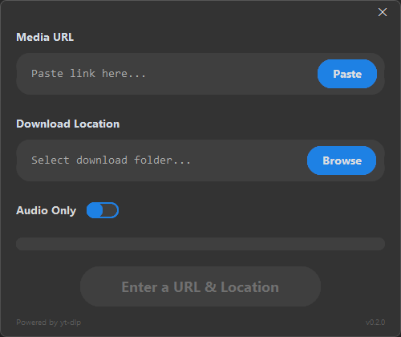
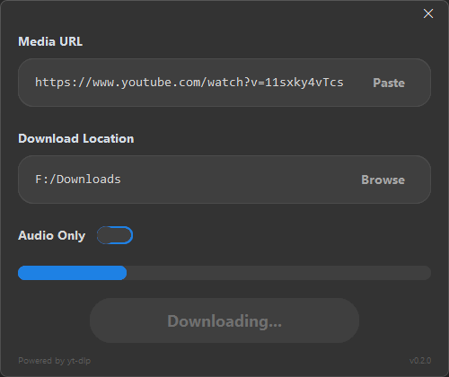
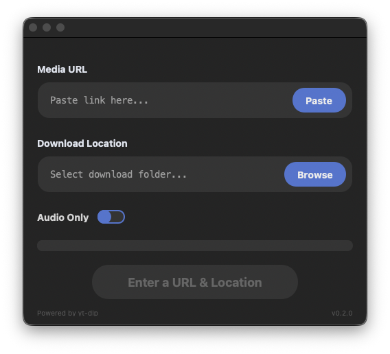

# Universal Media Downloader
A powerful, easy-to-use GUI for downloading media from various platforms. A standalone, high-performance media archiving utility for Windows and macOS. Built as an educational project exploring Python GUI development, asynchronous threading, and integrating external binaries (`yt-dlp`, `deno`, `FFmpeg`) into a single compiled executable.

---

## Download

Click the links below to get the latest stable version for your platform:

- **Windows:** [Download Latest Executable (win64)](https://github.com/insomniac-8235/UniversalDownloader/releases/latest)  
- **macOS:** [Download Latest DMG](https://github.com/insomniac-8235/UniversalDownloader/releases/latest)

---

## Features
* **Simple GUI:** Built with CustomTkinter for a modern look.  
* **High Quality:** Powered by `yt-dlp` for the best available resolution.  
* **Portable:** No installation required on Windows; drag-and-drop to Applications on macOS.  
* **Cross-Platform:** Fully supports Windows and macOS.  

---

## Screenshots

### Windows Main Window
  
*Paste URLs and start downloads on Windows.*

### Windows Download Progress
  
*Shows real-time progress*

### macOS Main Window
  
*The macOS interface, visually similar to Windows.*

---

## How to Use

### Windows
1. Download `UniversalDownloader_win64_vX.Y.Z.exe`.  
2. Double-click to run. **Note:** Windows SmartScreen may show a warning since the app is unsigned. Click **More Info → Run Anyway** to proceed.  
3. Paste your media URL, select folder and click **Download**.

### macOS
1. Download `UniversalDownloader_macOS_vX.Y.Z.dmg`.  
2. Open the DMG and drag the app to **Applications**.  
3. Launch the app, paste your media URL, select folder and click **Download**.

---

## Technical Features & Learning Outcomes
* **Binary Bundling:** Packed FFmpeg into headless PyInstaller executables for both platforms.
* **Thread-Safe UI:** CustomTkinter interface with logger updates safely passed from background threads.  
* **Maximum Quality:** Auto-selects best video/audio streams and merges them natively.  
* **Cross-Platform Consistency:** Windows and macOS versions behave identically with proper versioning.

---

## Core Technologies
* **Engine:** [yt-dlp](https://github.com/yt-dlp/yt-dlp)
* **UI Framework:** [CustomTkinter](https://github.com/TomSchimansky/CustomTkinter)
* **Media Merging:** [FFmpeg](https://ffmpeg.org/)

---

## Contributing
Contributions are welcome! Fork the repository, make changes, and submit a pull request.